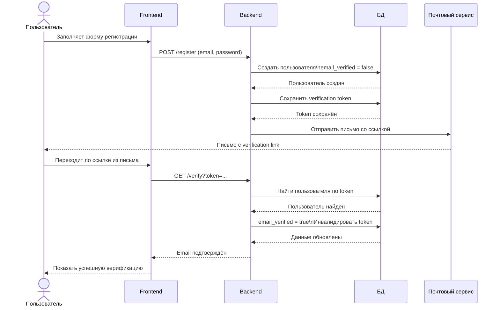

# Email Verification — Sequence Diagram

```mermaid
sequenceDiagram
    actor User as Пользователь
    participant Frontend as Frontend
    participant Backend as Backend
    participant DB as БД
    participant Mail as Почтовый сервис

    User->>Frontend: Заполняет форму регистрации
    Frontend->>Backend: POST /register (email, password)

    Backend->>DB: Создать пользователя\nemail_verified = false
    DB-->>Backend: Пользователь создан

    Backend->>DB: Сохранить verification token
    DB-->>Backend: Token сохранён

    Backend->>Mail: Отправить письмо со ссылкой
    Mail-->>User: Письмо с verification link

    User->>Frontend: Переходит по ссылке из письма
    Frontend->>Backend: GET /verify?token=...

    Backend->>DB: Найти пользователя по token
    DB-->>Backend: Пользователь найден

    Backend->>DB: email_verified = true\nИнвалидировать token
    DB-->>Backend: Данные обновлены

    Backend-->>Frontend: Email подтверждён
    Frontend-->>User: Показать успешную верификацию
```
