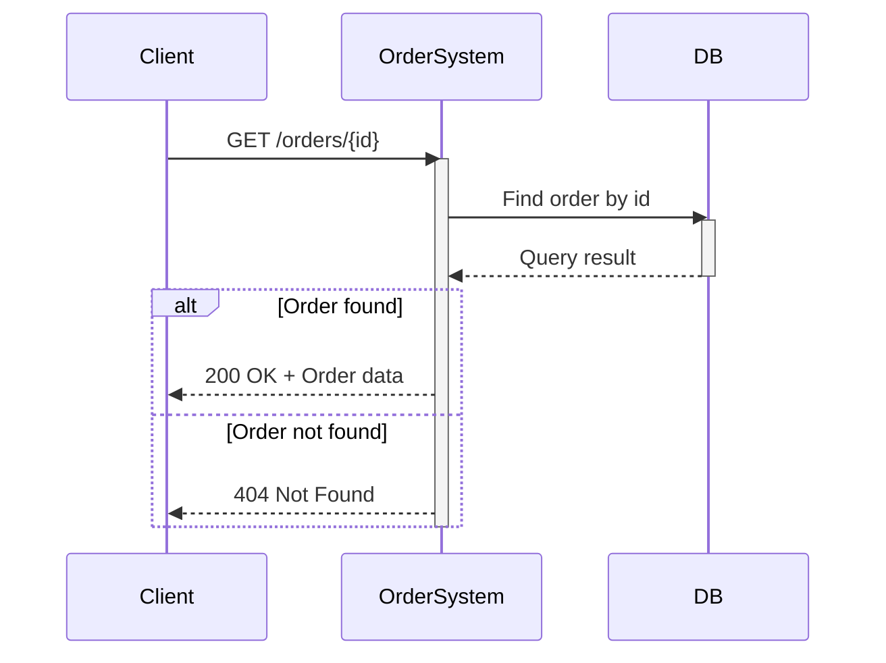
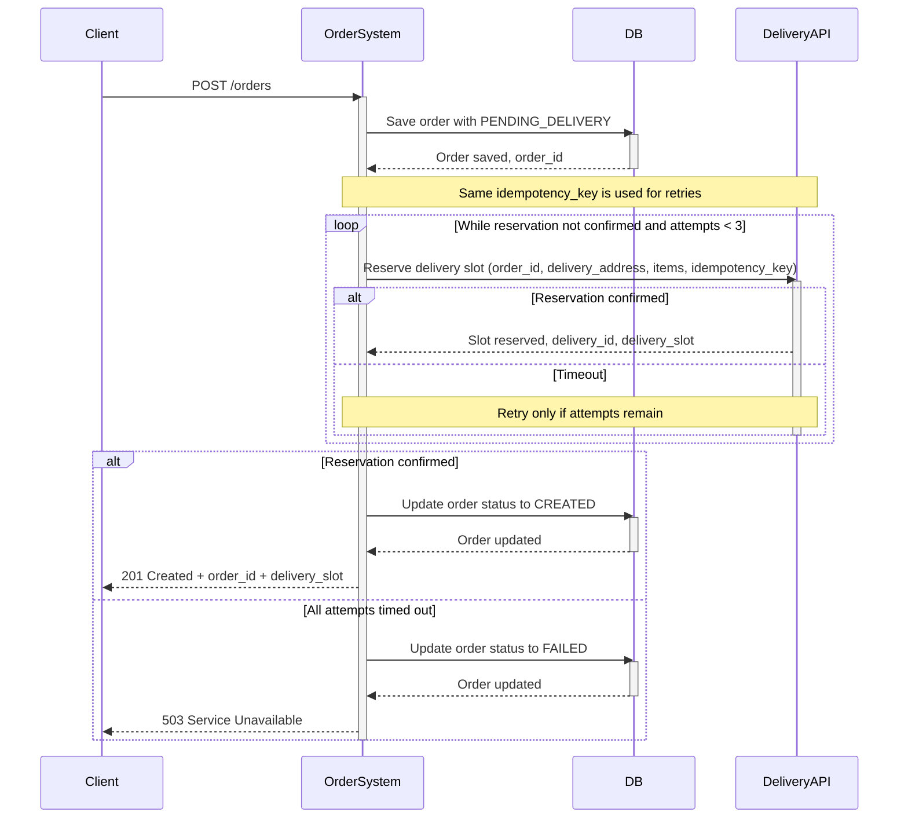

# Агрегатор заказов и службы доставки

## GET /orders/{id}

INPUT
| Имя параметра | Тип данных | Обязательность | Описание |
| ------- | ------- | ------- | ------- |
| user_id | UUID или Integer | yes | Идентификатор пользователя |
| delivery_address | String | yes | Адрес доставки |
| items | Array | yes | Состав заказа |

OUTPUT
| Имя параметра | Тип данных | Описание |
| ------- | ------- | ------- |
| order_id | UUID или Integer | Уникальный идентификатор заказа на доставку |
| status | String | Статус созданного заказа |
| delivery_slot | DateTime / String | Зарезервированный интервал доставки |

#### POST /orders

INPUT
| Имя параметра | Тип данных | Обязательность | Описание |
| ------- | ------- | ------- | ------- |
| order_id | UUID или Integer | yes | Уникальный идентификатор заказа на доставку |
| delivery_address | String | yes | Адрес доставки |
| items | Array | yes | Состав заказа |
| idempotency_key | UUID / String | yes | Идентификатор операции для безопасного повторного запроса |

OUTPUT
| Имя параметра | Тип данных | Описание |
| ------- | ------- | ------- |
| delivery_id | UUID или Integer | Идентификатор созданного резервирования доставки |
| delivery_slot | DateTime / String | Зарезервированный интервал доставки |

Mapping table
| Поле нашей системы | Поле Delivery API | Логика преобразования |
| ------- | ------- | ------- |
| order_id | external_order_id | Передать без изменений |
| delivery_address | destination | Передать без изменений |
| items | cargo_items | Преобразовать элементы заказа в формат Delivery API |
| idempotency_key | Idempotency-Key | Передать в HTTP-заголовке; использовать тот же ключ для всех retry |