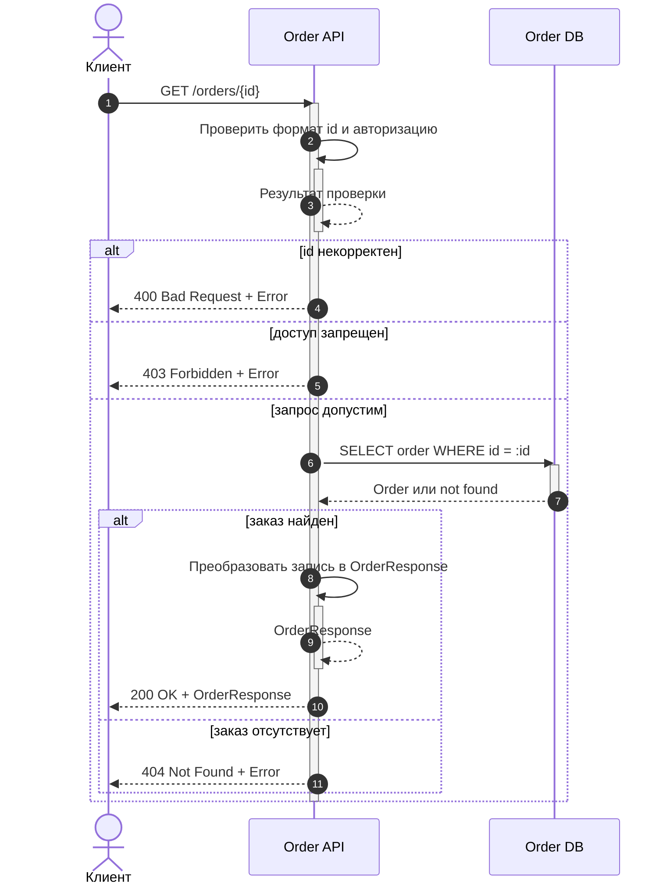
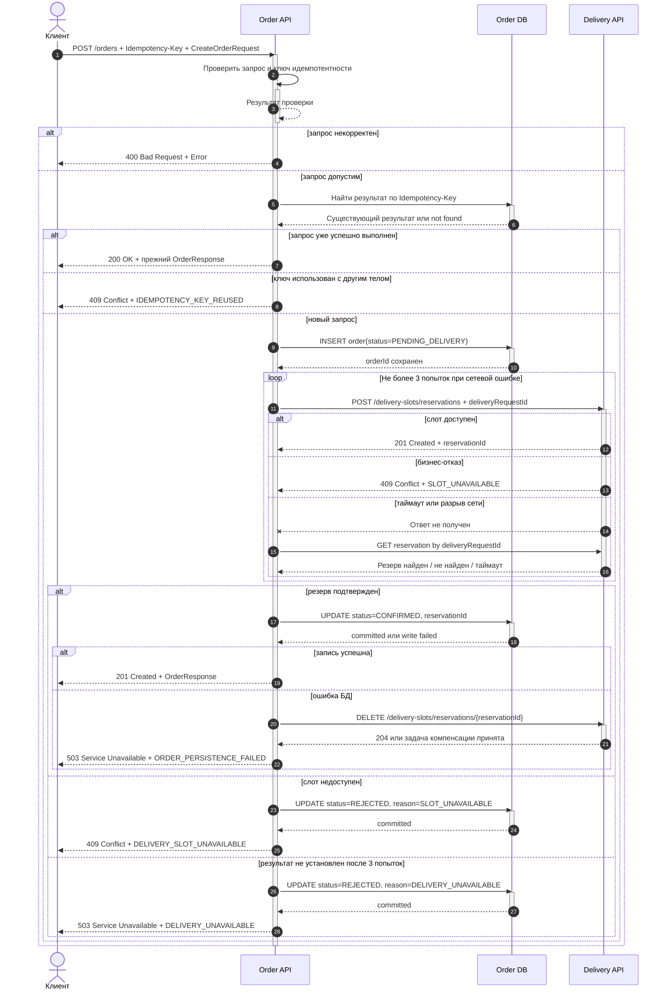

# Решение задания: агрегатор заказов и службы доставки

> Если Markdown-просмотрщик не поддерживает Mermaid, откройте [интерактивные диаграммы](./task-1-diagrams.html) в браузере.

## Принятые проектные решения

- `POST /orders` принимает клиентский `Idempotency-Key`, чтобы повтор запроса клиента не создавал дубликаты заказа.
- Перед обращением к службе доставки заказ сохраняется в БД в техническом статусе `PENDING_DELIVERY`.
- Запрос резервирования повторяется не более трех раз с тем же ключом идемпотентности. Повтор с новым ключом мог бы создать несколько резервов.
- После таймаута система запрашивает результат операции по ключу идемпотентности: таймаут не доказывает, что внешний сервис не выполнил запрос.
- Заказ считается созданным только после подтвержденного резерва и перехода в статус `CONFIRMED`.
- Если резерв не получен, черновик переводится в `REJECTED`; API возвращает ошибку, а не созданный заказ.
- Если резерв создан, но финальное сохранение заказа не удалось, система отправляет компенсирующую отмену резерва.

## Диаграмма последовательности: `GET /orders/{id}`

## Диаграмма последовательности: `POST /orders`

## Контракты публичного API

### `GET /orders/{id}` — входные параметры

| Имя параметра | Расположение | Тип данных | Обязательность | Описание |
| :--- | :--- | :--- | :--- | :--- |
| `id` | path | UUID | Да | Идентификатор заказа |
| `Authorization` | header | String | Да | Bearer-токен пользователя |

### `GET /orders/{id}` — успешный ответ `200 OK`

| Имя параметра | Тип данных | Описание |
| :--- | :--- | :--- |
| `id` | UUID | Идентификатор заказа |
| `customerId` | UUID | Идентификатор покупателя |
| `status` | Enum | `PENDING_DELIVERY`, `CONFIRMED` или `REJECTED` |
| `items` | Array&lt;OrderItem&gt; | Позиции заказа |
| `delivery.address` | Address | Адрес доставки |
| `delivery.slotStart` | DateTime (ISO 8601) | Начало интервала доставки |
| `delivery.slotEnd` | DateTime (ISO 8601) | Конец интервала доставки |
| `delivery.reservationId` | String, nullable | Идентификатор подтвержденного резерва |
| `createdAt` | DateTime (ISO 8601) | Время создания записи |

Ошибки: `400 INVALID_ORDER_ID`, `403 ACCESS_DENIED`, `404 ORDER_NOT_FOUND`, `500 INTERNAL_ERROR`.

### `POST /orders` — входные параметры

| Имя параметра | Расположение | Тип данных | Обязательность | Описание |
| :--- | :--- | :--- | :--- | :--- |
| `Authorization` | header | String | Да | Bearer-токен пользователя |
| `Idempotency-Key` | header | UUID | Да | Ключ идемпотентности создания заказа |
| `customerId` | body | UUID | Да | Идентификатор покупателя |
| `items` | body | Array&lt;OrderItemInput&gt; | Да | Непустой список позиций |
| `items[].productId` | body | UUID | Да | Идентификатор товара |
| `items[].quantity` | body | Integer | Да | Количество, целое число больше нуля |
| `deliveryAddress` | body | Address | Да | Адрес курьерской доставки |
| `deliverySlot.start` | body | DateTime (ISO 8601) | Да | Начало желаемого интервала |
| `deliverySlot.end` | body | DateTime (ISO 8601) | Да | Конец желаемого интервала |

### `POST /orders` — успешный ответ `201 Created`

| Имя параметра | Тип данных | Описание |
| :--- | :--- | :--- |
| `id` | UUID | Идентификатор созданного заказа |
| `status` | Enum | Всегда `CONFIRMED` для нового успешного ответа |
| `items` | Array&lt;OrderItem&gt; | Зафиксированные позиции заказа |
| `delivery` | Delivery | Адрес, интервал и `reservationId` |
| `createdAt` | DateTime (ISO 8601) | Время создания заказа |

При повторе успешно выполненного запроса возвращается `200 OK` с тем же представлением заказа. Ошибки: `400 VALIDATION_ERROR`, `409 IDEMPOTENCY_KEY_REUSED`, `409 DELIVERY_SLOT_UNAVAILABLE`, `503 DELIVERY_UNAVAILABLE`, `503 ORDER_PERSISTENCE_FAILED`, `500 INTERNAL_ERROR`.

### Единый формат ошибки

| Имя параметра | Тип данных | Описание |
| :--- | :--- | :--- |
| `code` | String | Машиночитаемый код ошибки |
| `message` | String | Безопасное для клиента описание |
| `traceId` | String | Идентификатор запроса для диагностики |
| `retryable` | Boolean | Можно ли безопасно повторить запрос с тем же `Idempotency-Key` |

## Контракты вызовов внешней службы доставки

### `POST /delivery-slots/reservations` — вход

| Имя параметра | Тип данных | Обязательность | Описание |
| :--- | :--- | :--- | :--- |
| `deliveryRequestId` | UUID | Да | Стабильный ключ идемпотентности для всех повторов |
| `orderReference` | UUID | Да | Идентификатор черновика заказа |
| `address` | DeliveryAddress | Да | Адрес в формате службы доставки |
| `interval.from` | DateTime (UTC) | Да | Начало интервала в UTC |
| `interval.to` | DateTime (UTC) | Да | Конец интервала в UTC |
| `packages` | Array&lt;Package&gt; | Да | Рассчитанные грузовые места |

### `POST /delivery-slots/reservations` — выход

| Имя параметра | Тип данных | Описание |
| :--- | :--- | :--- |
| `reservationId` | String | Идентификатор резерва во внешней системе |
| `status` | Enum | `RESERVED` или `REJECTED` |
| `expiresAt` | DateTime (UTC) | Срок действия резерва |
| `reasonCode` | String, nullable | Причина отказа |

### Служебные вызовы доставки

| Вызов | Вход | Успешный результат | Назначение |
| :--- | :--- | :--- | :--- |
| `GET /delivery-slots/reservations/by-key/{deliveryRequestId}` | `deliveryRequestId: UUID` | `200 Reservation` или `404` | Установить итог неоднозначного запроса после таймаута |
| `DELETE /delivery-slots/reservations/{reservationId}` | `reservationId: String` | `204 No Content` | Компенсировать резерв, если заказ не удалось подтвердить в БД |

## Таблица маппинга в API службы доставки

| Поле нашей системы | Поле внешнего API | Логика преобразования |
| :--- | :--- | :--- |
| `Idempotency-Key` | `deliveryRequestId` | Передать без изменения; повторно использовать во всех попытках |
| `order.id` | `orderReference` | UUID преобразовать в строковое представление |
| `deliveryAddress.city` | `address.locality` | Нормализовать по справочнику населенных пунктов |
| `deliveryAddress.street` | `address.streetLine` | Объединить улицу, дом, корпус и квартиру в одну строку |
| `deliverySlot.start` | `interval.from` | Преобразовать из часового пояса магазина в UTC |
| `deliverySlot.end` | `interval.to` | Преобразовать из часового пояса магазина в UTC |
| `items[].quantity` и габариты товара | `packages[]` | Сгруппировать позиции в грузовые места и рассчитать вес/габариты |

## Допущения и открытые вопросы

1. Предполагается, что служба доставки поддерживает идемпотентное резервирование и поиск результата по ключу. Если это не так, нужен внутренний адаптер с журналом операций и механизмом сверки.
2. Требуется согласовать задержки между попытками, общий таймаут и политику повторов; в диаграмме зафиксирован только предел в три попытки.
3. Требуется определить срок хранения записей `REJECTED` и ключей идемпотентности.
4. Требуется уточнить, должен ли `GET /orders/{id}` показывать технические статусы клиенту или преобразовывать их в публичные состояния.
5. Требуется определить поведение при неуспешной компенсирующей отмене резерва. Практический вариант — сохранить задачу в transactional outbox и повторять компенсацию асинхронно.
